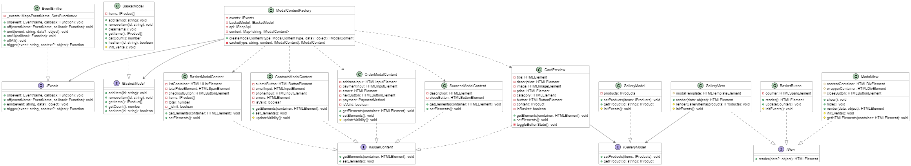

# Проектная работа "Веб-ларек"

Стек: HTML, SCSS, TS, Webpack

## Структура проекта:



- **src/** — исходные файлы проекта
  - **src/components/** — папка с JS компонентами
    - **src/components/base/** — папка с базовым кодом
    - **src/components/modals/** — папка с модальными окнами
    - **src/components/gallery/** — папка с галереей товаров
  - **src/types/** — папка с типами данных
  - **src/utils/** — папка с утилитами

### Важные файлы:

- src/pages/index.html — HTML-файл главной страницы
- src/types/index.ts — файл с типами
- src/index.ts — точка входа приложения
- src/scss/styles.scss — корневой файл стилей
- src/utils/constants.ts — файл с константами
- src/utils/utils.ts — файл с утилитами

### Описание структуры базового кода, компонентов и моделей данных:

- **Базовый код**: включает в себя общие интерфейсы и классы, такие как `EventEmitter` для управления событиями.
- **Компоненты**: реализуют функциональность приложения, включая модальные окна, галерею товаров и корзину.
- **Модели данных**: представляют собой классы, управляющие состоянием данных, такие как `BasketModel`, `ModalModel` `GalleryModel`.

### Назначение каждого элемента:

- **EventEmitter**: управляет событиями в приложении, позволяя компонентам взаимодействовать друг с другом.
- **BasketModel**: управляет состоянием корзины, добавлением и удалением товаров.
- **GalleryModel**: управляет списком товаров, отображаемых в галерее.
- **ModalModel**: управляет общим состоянием модальных окон.
- **ModalContentFactory**: фабрика для создания модальных окон с кешированием.

### Описание программного интерфейса компонентов:

- **IModalContent**: интерфейс для модальных окон, определяет методы `getElements` и `setElements`.
- **IView**: интерфейс для рендеринга элементов, определяет метод `render`.
- **IEvents**: интерфейс для управления событиями, включает методы `on`, `off`, `emit`.
- **IShopApi**: интерфейс для API, определяет методы `getProducts`, `getProduct`, `createOrder`.

### Описание типов данных:

- **IProduct**: описывает структуру объекта продукта с полями `id`, `title`, `description`, `image`, `price`, `category`.
- **IProductsResponse**: описывает структуру ответа API на запрос списка продуктов.
- **IOrder**: описывает структуру объекта заказа с полями `total`, `items`, `payment`, `email`, `phone`, `address`.
- **IOrderResponse**: описывает структуру ответа API на запрос создания заказа.
- **PaymentMethod**: перечисление с методами оплаты.
- **ModalContentType**: перечисление с типами модальных окон.

### Взаимодействие частей приложения:

- **Компоненты** взаимодействуют через события, управляемые `EventEmitter`.
- **Модели данных** обновляют состояние приложения и уведомляют компоненты об изменениях через события.
- **Модальные окна** отображают информацию и взаимодействуют с пользователем, используя данные из моделей.


## Установка и запуск

Для установки и запуска проекта необходимо выполнить команды

```
npm install
npm run start
```

или

```
yarn
yarn start
```

## Сборка

```
npm run build
```

или

```
yarn build
```

